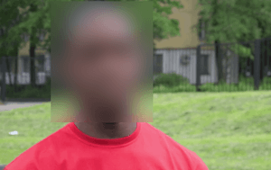
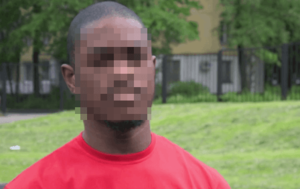
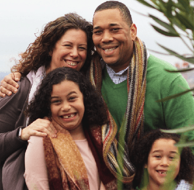
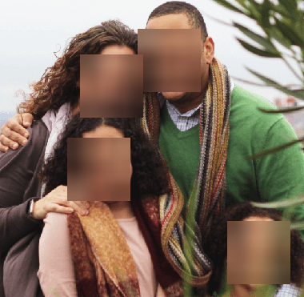
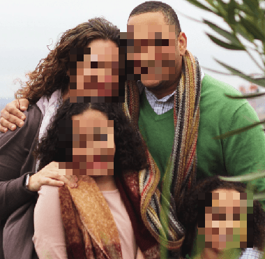

# 動機
face_recognitionを使用して得られる顔座標は長方形であり、この座標をそのまま用いてぼかし処理を行った場合得られる画像は醜い。
  
それに対してモザイクによってぼかし処理を行うと自然に見える。
  
これを静止画だけでなく動画にも適用したい。

# 方法
face_recognitionのメソッドである`face_recognition.face_locations`の返り値は`(top, right, bottom, left)`の配列。
## 顔周りの長方形をぼかす
original.png
  

```python
import cv2
import face_recognition

image = cv2.imread('img/original.png')
face_location_list = face_recognition.face_locations(
    image, 0, 'cnn')
if len(face_location_list) > 0:
    dst = image.copy()
    for (top, right, bottom, left) in face_location_list:
        dst[top:top + (bottom - top), left:left + (right - left)] = cv2.blur(
            dst[top:top + (bottom - top), left:left + (right - left)], (50, 50))
    cv2.imwrite('img/rectangle_blur.png', dst)
```
  

## モザイク処理
モザイク処理の方法は[note.nkmk.me Python, OpenCVで画像にモザイク処理（全面、一部、顔など）](https://note.nkmk.me/python-opencv-mosaic/)様よりアイデアを頂戴致しました。

```python
def mosaic(src, ratio):
    small = cv2.resize(src, None, fx=ratio, fy=ratio,
                       interpolation=cv2.INTER_NEAREST)
    return cv2.resize(small, src.shape[:2][::-1], interpolation=cv2.INTER_NEAREST)


if len(face_location_list) > 0:
    dst = image.copy()
    for (top, right, bottom, left) in face_location_list:
        dst[top:top + (bottom - top), left:left + (right - left)] = mosaic(
            dst[top:top + (bottom - top), left:left + (right - left)], 0.1)
    cv2.imwrite('img/rectangle_mosaic.png', dst)
```
  

## 動画に適用
<a href="https://pixabay.com/ja/?utm_source=link-attribution&amp;utm_medium=referral&amp;utm_campaign=image&amp;utm_content=87593">Pixabay</a>が提供する<a href="https://pixabay.com/ja/users/magicboxstudio-23243171/?utm_source=link-attribution&amp;utm_medium=referral&amp;utm_campaign=image&amp;utm_content=87593">Oybek Ostanov</a>の動画を`video.mp4`としてblur処理を行う。

```python
import cv2
import face_recognition
import PySimpleGUI as sg

vcap = cv2.VideoCapture('img/video.mp4', cv2.CAP_FFMPEG)


def mosaic(src, ratio):
    small = cv2.resize(src, None, fx=ratio, fy=ratio,
                       interpolation=cv2.INTER_NEAREST)
    return cv2.resize(small, src.shape[:2][::-1], interpolation=cv2.INTER_NEAREST)


sg.theme('Reddit')
layout = [
    [sg.Text('blur')],
    [sg.Image(key='display')],
    [sg.Button('terminate', key='terminate', button_color='red')]
]
window = sg.Window('blur', layout, location=(50, 50))

while True:
    ret, frame = vcap.read()
    if ret == False:
        break
    face_location_list = face_recognition.face_locations(
        frame, 0, 'cnn')

    if len(face_location_list) > 0:
        dst = frame.copy()
        for (top, right, bottom, left) in face_location_list:
            # rectangle blur ======
            # dst[top:top + (bottom - top), left:left + (right - left)] = cv2.blur(
            #     dst[top:top + (bottom - top), left:left + (right - left)], (50, 50))
            # mosaic blur =========
            dst[top:top + (bottom - top), left:left + (right - left)] = mosaic(
                dst[top:top + (bottom - top), left:left + (right - left)], 0.1)

    event, _ = window.read(timeout=1)
    imgbytes = cv2.imencode(".png", dst)[1].tobytes()
    window["display"].update(data=imgbytes)
    if event == 'terminate':
        break
vcap.release()
```
# 結果
  
  

期待通りの結果が得られました。